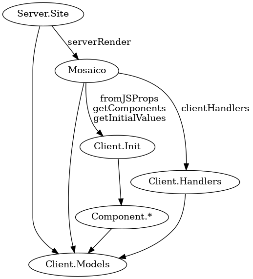

Mosaico is HBL Media's news site project.  It is written in PureScript
and uses React via purescript-react-basic library.  It is a hybrid SPA
application, with server side renders covering the equivalent of using
the site with no user account.  It uses React's hydrate method to
seamlessly transition from a server render to a full React application
mode, with no need to show a loading screen while data and scripts are
still being loaded.

Building output with React is a matter of combining opaque JSX blocks
together.  They represent sections of the DOM tree and they can be
nested inside other elements but only at construction time.  Once you
have JSX the only thing you can do with them is to concatenate them.

The way the site is set up, in principle, you could disable JavaScript
from the browser and basically have equivalent experience to browsing
the site without logging in.  Of course, discounting all the routing
that makes transitioning to reading an article smoother and so on.
Not all "modern" web sites have that property.

# Parameters used for rendering

The Mosaico render function requires 5 things to function: Hooks,
Components, Handlers, Props and State.  The same render function is
called in both server and client context and the way they are set up
differs in each.

## Hooks

Hooks is the easy case: They are static and determined at compile time
but a different set of hooks is used in each environment.  So it's
just a matter of giving the correct parameter when calling the render.

## Components

React's components are basically render functions which hold internal
state.  They take a Props as a parameter and produce JSX as a result.
In PureScript's context, they are naturally represented as functions
`Props -> JSX`.  Take note that each of them will typically have Props
specific to each component.  In Mosaico, the subcomponents it uses are
collected into a single Components type which contains a number of
`Props -> JSX` functions, where each `Props` is different and specific
to that component.

In client context, each of these components will have internal state
and they are created at start up time.  The components' life cycle is
handled implicitly by whether they are included into the rendered JSX
or not, and from changes to the Props each receives.  In server
context the components are stateless and as such they get short cutted
and just call the render functions directly with empty state.  There's
no type level or any other enforcement of this property, it's just
handled by the way the components are organized: Each of them has a
component creation function which is skipped for server context, and
they have a render function as well which is set up to take a `Maybe
State` and `Props`.

## Handlers

Handlers is a record of `EventHandler` and `Effect` functions,
typically something that you'd put into some `onClick` handler.  In
client context they call various `setState` effects to make changes to
Mosaico's State.  In server context, all the handlers are replaced by
dummy implementations that do nothing.

## Props

As stated above, a React component takes Props and the same applies to
the main level component as well.  I'll go later into more details
about what's contained in it, but for now suffice to say that for
client context it is fixed for the duration of the web app.  For
server context it is specific for each request.

As each of the components has Props and the main component has Props
as well, for the rest of this discussion Props with no qualifiers is
the main level Props and the components' Props is going to be
qualified, like User.Props or Article.Props.

## State

Finally, State.  Specifically it can only have plain values.
Typically a React component comes with setters for the state as well
but they are omitted from this data and instead the uses they require
are covered in Handlers.  In client context, State is constructed from
the internal state of Mosaico.  In server context there's really no
difference between State and Props and it's, like Props, something
that's constructed for each request.

## Summary

|            | Server  | Client      |
|------------|---------|-------------|
| Hooks      | fixed   | fixed       |
| Components | fixed   | at start up |
| Handlers   | fixed   | dynamic     |
| Props      | dynamic | at start up |
| State      | dynamic | dynamic     |

For the server, "dynamic" means "for each request".  For the client,
it'll involve asynchronous events, including network and timed events
or user interaction.

# Feeds and window variables

Before going into how the client initialization flows, we need to
cover a bit more about what goes into Props.  The idea with React's
hydrate is that the DOM tree it receives is representative of what the
rendered content is like, given the same Props as that were used on
the server render.  Specifically, the server generated DOM is not to
be used as input but its purpose is to avoid re-rendering the content
when the client side app code fires up.  The idea is that given same
Props, the DOM should be the same on both renders.

What the server sends is not just the DOM but an even more important
part of it is the data needed to set up Props used to initialize the
client app.  That data is called in Mosaico "window variables" (it's a
bit odd name but it stuck since we use the global window variable to
hold it) and one major part is that is the JSON serialization of
Feeds.  The window variables data is sent to the client inside a
script tag in the server generated HTML.

Feeds represents a list of articles.  It doesn't hold full articles
but just the metadata.  We call them ArticleStubs in Mosaico and
Lettera.  It has the data required both to render lists and to render
basic information of an article immediately while the full article is
being loaded from Lettera.

Feeds can hold, in addition to lists of articles, prerendered HTML
content.  Our main category works by generating HTML in the publishing
system and Mosaico shows that on the main page as is.  This is where
the Hooks come in: We may alter what we get from the server at
Mosaico's level as well.  This is used to set up serving ads within
the prerendered content.

Feeds can be serialized as JSON and deserialized from that as well.
The server render renders the content as DOM, sends that and the feed
data to client side, the client side deserializes the feed data and
uses that to populate State and render the content and React's hydrate
makes the transition seamless.

Later on, Feeds data is a part of State that will be used for
rendering.  If initial Feeds data was not available via window
variables, the first thing that Mosaico would be forced to do when it
starts up is to load the data from Lettera.  The content user would
have downloaded from the server side Mosaico would then be immediately
replaced with a loading spinner and it would be replaced again with
the actual content once the download is complete.  There's no option
to tell React to keep the old data while doing something else, it
needs to have the state from the get go that'd render the same
content.

The other major window variable is category structure.  Our sites are
organized into a small number of main categories (you'll see them in
the header bar element) and possibly subcategories contained within
the main categories.  Without category structure data Mosaico wouldn't
even know how to render the starting page and it's a fatal error if
it's not available.  It's fixed for the duration of Mosaico's life
time, also for server context.

# Initialization

Now we are ready to go through the details of initialization flow.
With purescript-react-basic-hooks, the `component` function that
creates a component has access to the usual `Effect` monad before
starting the component definition with `React.do`.  The first thing
this is used for is to invoke `getInitialValues`, which does some
effectful things that can be done with the information client
environment has statically.  The other thing it does is to create
components with `getComponents` and populates the Components data with
them.

Building Props is the second step of initialization.  As the main
level component, the Props data will never change for the duration of
the application.  To save some computation, Mosaico does some
`unsafePerformEffect` trickery to memoize the deserialized and
computed Props given with the window variables.

The main Mosaico code doesn't interact with any of the subcomponents'
modules directly but it's all done via the Components record that's
set up during the initialization phase, via constructing their
required Props from Handlers, State and Props available in the main
render function.  Having done that the main render gets access to the
subcomponents' JSX, which it uses by including it in the rendered JSX.

## Full SPA mode

For our development use, it's possible to use Mosaico in full single
page app mode as well.  With that, there are no window variables
available since there's no server side either.  Everything in Feeds
can be loaded dynamically, it's just going to involve some loading
spinners while it does that.  The category structure data is still
mandatory and it's loaded via a Promise before even starting the React
code.
