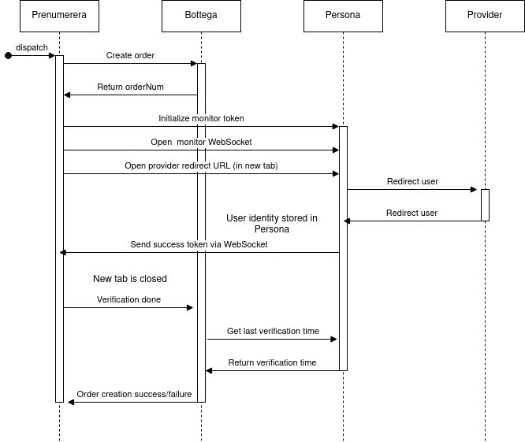

A design choice with our purchase paths has been that they work as
single page apps and we haven't implemented routing to recover its
state if we need to redirect the user to a different web site as a
part of it.  Initially this involved embedding the opened page as an
iframe (for inputting payment card details directly to our payments
processor) but later on we changed that to be done in a new window
instead.

We have two billing options: either via payment cards or via
invoicing.  Originally, the invoicing option path initiated the
purchase immediately with no further verifications.  With changing
consumer protection laws it became necessary for us to verify the
customer's identity.  In Finland that's commonly done by directing
them to a net bank where they sign in to their account and the bank
tells the user identity back to the initiating service.

On a technical level, this means implementing OpenID Connect flow.
This article doesn't cover how that's implemented and there are
multiple sources on the Internet that go through that in details.  I
suggest reading some of those before continuing with this.  This
concerns how to use that with a SPA client side program without
exiting that context during the process.

Our authentication backend is called Persona and our order processing
backend is called Bottega.  The front end process the user is using is
called Persona.  The identity provider is called just "provider" in
this presentation.  Persona has its own authentication implemented
which is a completely separate thing from the user identification we
do with OpenID Connect.  Some parts of our set up require its
authentication headers for the purpose of attaching the identification
we get to a user account.

On a high level, ignoring all the communication between a backend
server and the identity provider, the OpenID Connect flow involves two
endpoints for a user.  Both of these are implemented in our own
backend, in Persona:

1. The redirect endpoint.
2. The return endpoint.

The flow starts by pointing the customer to first of those, which will
perform a HTTP redirect to the provider's service.  On our end we have
no visibility to what happens in there but the end result after a
success is that the user's browser is directed to the second endpoint
on our backend.  It's an address that we have registered with the
provider beforehand.

Since we need to preserve the SPA context, we can't just directly send
the user to the redirect endpoint but need to make a new window where
we do that.  This involves a few extra steps prior to going to the
OpenID Connect flow:

1. Create a subscription with Bottega (with our authentication
   credentials)
2. Call a monitor token init endpoint in Persona.  It generates a random token
   and stores it in cookies.  It takes no auth.  One noteworthy thing is
   that for a browser to store the cookie, the AJAX request we do needs
   the
   [withCredentials](https://developer.mozilla.org/en-US/docs/Web/API/XMLHttpRequest/withCredentials)
   attribute.
3. Create a WebSocket to Persona, with our own authorization
   credentials.  It takes the monitor token from the cookies and sets up
   an IPC listener for the event.  Details of how that's done is outside
   the scope of this article.
4. Perform the OpenID connect flow.  In the return endpoint, take the
   monitor cookie and use it to send IPC message to the waiting
   WebSocket.
5. Persona stores the verified identity (attaching it to the account
   matching the credentials given in step 3).  Prenumerera gets a success
   message from the WebSocket.
6. Prenumerera calls an endpoint in Bottega to tell that the
   verification has been completed.
7. Bottega calls Prenumera which returns with a time stamp of last
   successful verification.  If it's later than the order creation time
   stamp (from step 1), it will proceed.

Prenumerera will attempt to programmatically close the user
verification tab after success but browsers may or may not allow that
so the backend will have a basic message about success along with a
request to close the tab.

One picture may tell more than 687 words so I'll end this with a
network timing diagram.

